# (WORK IN PROGRESS)


# Detect anamolies in streaming IoT data using EventStreams and Singlestore database on Cloud Pak for Data

In the chemical research plant, the containers containing various chemicals under study are required to be maintained within certain threshold. In our case the minimum temperature threshold is 27°F and maximum threshold is 30°F. If container temperatures are too low or if container temperatures are too high, the consequences could be fatal. Hence, a swift action must be taken when the container temperature crosses the defined threshold. In this code pattern, you will learn how to detect anamolies in IoT event streams using IBM Event Streams and IBM Cloud Pak for Data with [Singlestore](https://www.singlestore.com/) database. You will also learn how to predict the container temperatures for future days and detect on which day would the container cross the threshold.


## Flow

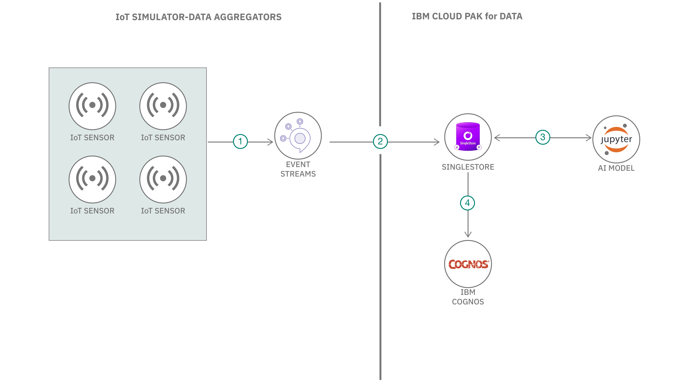


## Prerequisites
1. [IBM Cloud Account](https://cloud.ibm.com)
1. [IBM Cloud Pak for Data](https://cloud.ibm.com/catalog/content/ibm-cp-datacore-6825cc5d-dbf8-4ba2-ad98-690e6f221701-global)
1. [Install Singlestore database on Cloud Pak for Data](https://docs.singlestore.com/v7.3/reference/memsql-operator-reference/additional-deployment-methods/helm-chart-for-ibm-cloud-pak-for-data/)
1. [Java](https://www.java.com/en/)
1. [Gradle](https://gradle.org/)

## Steps

1. [Create an instance of IBM Event Streams](#1-create-an-instance-of-ibm-event-streams)
1. [Note broker urls](#2-note-broker-urls)
1. [Create credentials](#3-create-credentials)
1. [Download the SSL certificate from Event Streams](#4-download-the-ssl-certificate-from-event-streams)
1. [Upload the certificate to the Singlestore cluster](#5-upload-the-certificate-to-the-singlestore)
1. [Create a database, table and pipeline](#6-create-a-database-table-and-pipeline)
1. [Clone the repo](#7-clone-the-repo)
1. [Build and run the application](#8-build-and-run-the-application)
9. [Deploy and run the AI model on Cloud Pak for Data](#9-deploy-and-run-the-ai-model-on-cloud-pak-for-data)
10. [Create dashboard using IBM Cognos Analytics on Cloud Pak for Data](#10-create-dashboard-using-IBM-Cognos-Analytics-on-cloud-pak-for-data)

## 1. Create an instance of IBM Event Streams

Click [here](https://cloud.ibm.com/catalog/services/event-streams) to create an instance of Event Streams.
Select `Lite` plan and click `Create`.

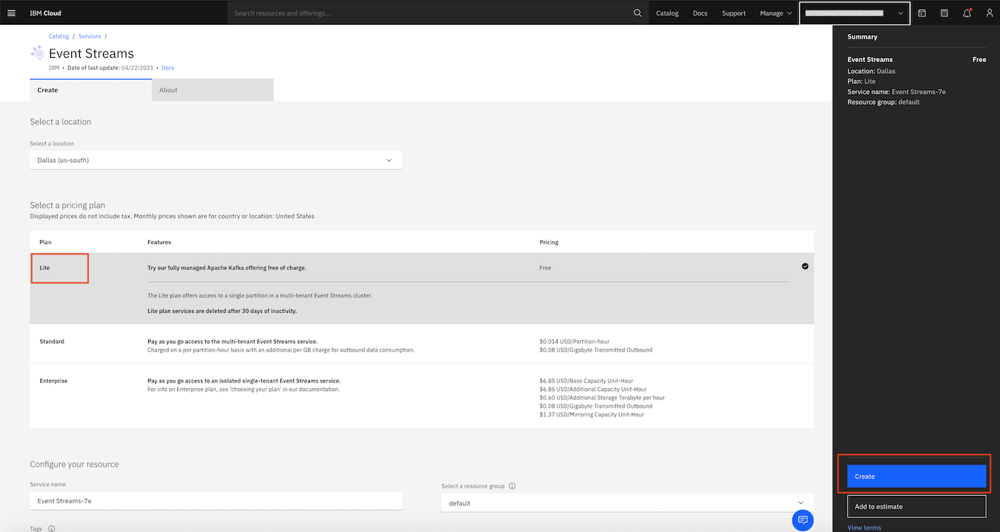

## 2. Note broker urls

Select `Home` on the menu and click on the paste icon to copy the comma separated broker urls.


>Note: The URLs will be needed to download the Event Streams SSL certificate and also to run the producer application

## 3. Create credentials

Select `Credentials` on the menu and click `New Credential`.

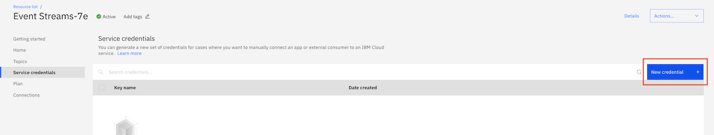

In the newly created credential, note the api key:

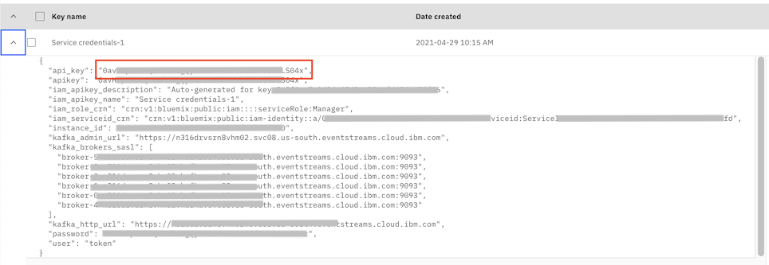

## 4. Download the SSL certificate from Event Streams

Open a terminal and run the below command after replacing `[broker-xxx-eventstreams.cloud.ibm.com:9093]` with one of the broker URLs noted earlier:
```
openssl s_client -connect [broker-xxx-eventstreams.cloud.ibm.com:9093] -servername [broker-xxx-eventstreams.cloud.ibm.com:9093] -showcerts > evtstreams.pem
```
The Event Streams certificate will be stored in a file `evtstreams.pem`.

## 5. Upload the certificate to the Singlestore cluster

Login to the Cloud Pak For Data cluster:

```
oc login --token=[token] --server=[url]
```

Create a secret for the Event Streams certificate after specifying the path to the directory that contains the `evtstreams.pem` that you downloaded earlier:
```
kubectl create secret generic node-memsql-cluster-master-0-additional-secrets --from-file=[Path to the directory where evtstreams.pem is downloaded]
```

## 6. Create a database, table and pipeline

Run the below command to open the SingleStore container shell:
```
kubectl exec -it node-memsql-cluster-master-0 /bin/bash
```

Login to the SingleStore DB with the credentials noted earlier:
```
memsql -u [username] -p[password]
```

### Create a new database

Run the below command to create a new database - `iotprediction`.

```
create database iotprediction;
use iotprediction;
```

### Create a table to store temperature data

Run the below command to create the table:
```
CREATE TABLE `data` (`id` int(11) DEFAULT NULL,`read_dt` datetime DEFAULT NULL,`temperature` int(4) DEFAULT NULL);
```

### Create a pipeline to consume data from Event Streams

Run the below command to create the pipeline after replacing the [Broker 0 URL] with the `broker-0` url we noted earlier(For example: `broker-0-xxx.kafka.svc08.us-south.eventstreams.cloud.ibm.com:9093`) and [API Key] with the api_key we noted earlier from credential:
```
CREATE PIPELINE `temperature_pipeline` AS LOAD DATA KAFKA '[Broker 0 URL]/tempreads' CONFIG '{"security.protocol": "sasl_ssl","sasl.mechanism": "PLAIN","ssl.certificate.location": "/etc/memsql/extra-secret/evtstreams.pem","sasl.username":"token"}' CREDENTIALS '{"ssl.key.password": "null","sasl.password": "[API Key]"}' INTO table data;
```

## 7. Clone the repo

Open a terminal and run the below command to clone the repo:
```
git clone https://github.com/IBM/anamoly-prediction-streams-singlestore-cp4d
```
## 8. Build and run the application

Change the directory:
```
cd sources/java/event-streams-producer-client/
```


Run the below command to build the application:
```
gradle clean build
```

Run the below command after replacing the [kafka_brokers_sasl] and [api_key] you noted earlier:
```
java -jar ./build/libs/event-streams-producer-client-2.0.jar [kafka_brokers_sasl] [api_key] -producer
```

>Note: The kafka_brokers_sasl must be formatted as "host:port,host2:port2". If not, format the contents of kafka_brokers_sasl in a text editor before entering it in the command line.

## 9. Deploy and run the AI model on Cloud Pak for Data

- Log into your `IBM Cloud Pak for Data` console.

- Click on the menu tab and select all projects.

- Create on `New project` tab.

- Select `Analytics project` and click on `Next`.

- Select `Create an empty project`.

- Give a name to the project and click on `Create`.

- Once the project is created you will be redirected to the project that you created. If you are not redirected to the project then navigate to the projects tab from main menu and then select the project that you created in step above.

- Click on `Add to project` and Select `Notebook` as shown below.

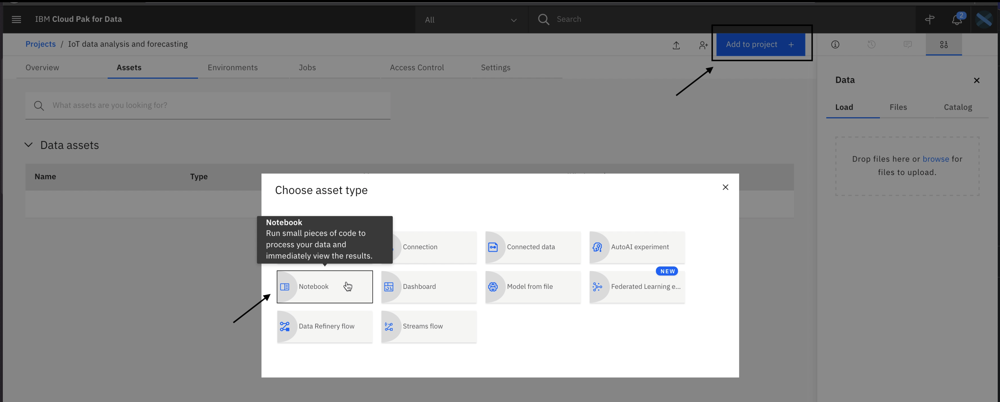

- Goto `From file` tab and upload the notebook `Notebook/IoT-Forecasting.ipynb` and click on `Create` as shown below. 


- Once the notebook loads, fill the singlestore credentials as shown below.

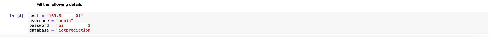

- Click on `Cell` tab and click `Run All`.

- Click on `File` tab and click `Save Version` as shown below.

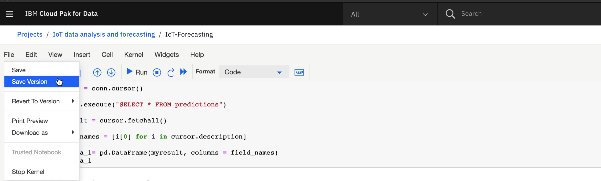

- Go back to `Assets` and create a job by following the gif in the dropdown below or alternatively you can follow the steps shown below.

<details>
<summary>Create Job</summary>
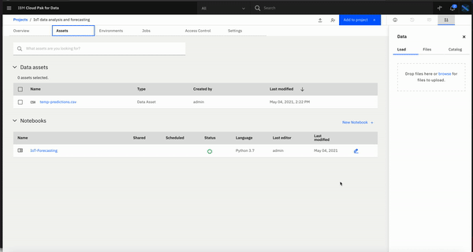
</details>

- Click on the three dots at the corner of the your notebook under `Notebooks` tab and select `Create Job`.

- Under `Define details` give a name for the job under `Name` section and click `Next`.

- Under `Configure` keep the default values and click `Next`.

- Under `Schedule` enable the schedule toggle switch. Check the `Repeat` checkbox. From the dropdown select `minutes` and write 4 beside it. Click on `Next`.

- Click on `Create`.

- Your job is now scheduled. Wait for sometime and then goto `Jobs` tab and check if the jobs are running.

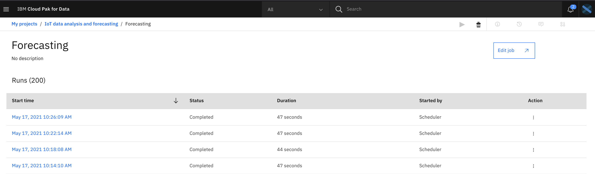

- The results of the AI model will be stored into `predictions` table on singlestore database.


## 10. Create dashboard using IBM Cognos Analytics on Cloud Pak for Data

There are 3 major steps to build a dashboard on IBM Cognos Analytics:
- 1. Create a connection to singlestore database
- 2. Create a module to load and publish the metadata to the cognos public folder section.
- 3. Access the module and build the dashboard.

### i. Create a connection to singlestore database

Launch IBM Cognos Analytics from CP4D instance console or ask the administrator to provide the Cognos Analytics url.

- Firstly, launch CP4D instance by using url provided by your adminstrator.
See the below screenshot of the CP4D login page. Provide appropriate credentials given by your administrator.
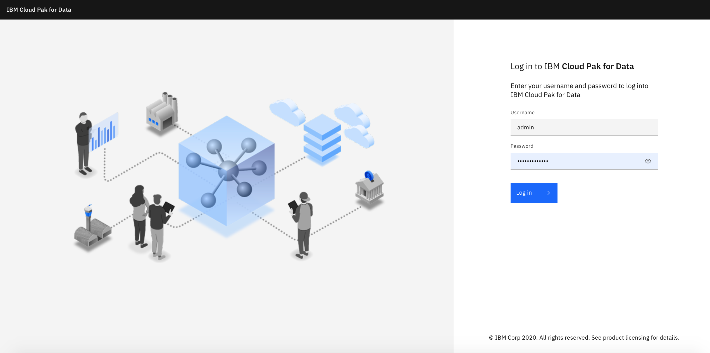

Now you will see a CP4D Home page as follows:
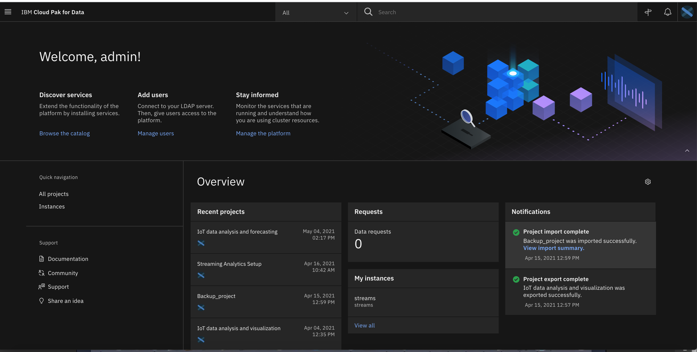

- Click on burger menu bar and click on `Instances` under services tab to see the installed services. Here we want to see if Cognos Analytics is installed. See below screenshot for details.
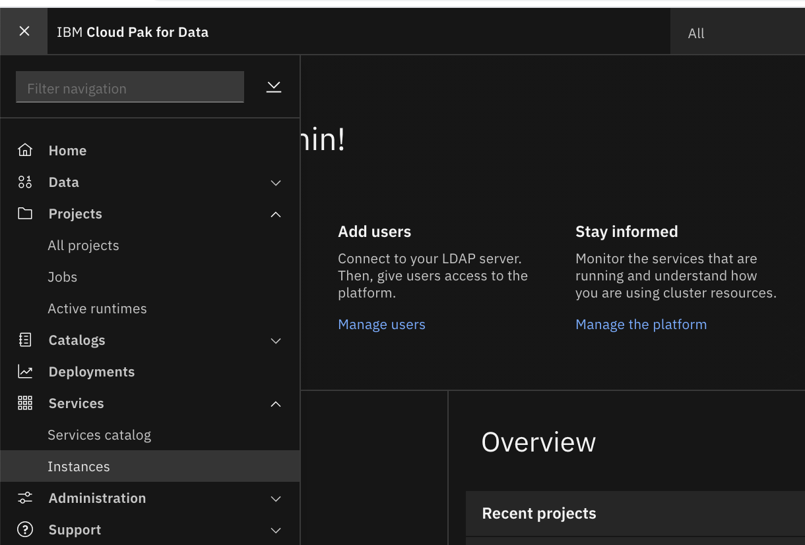

- Now click on Cognos Analytics to launch the instance. See below screenshot for details.
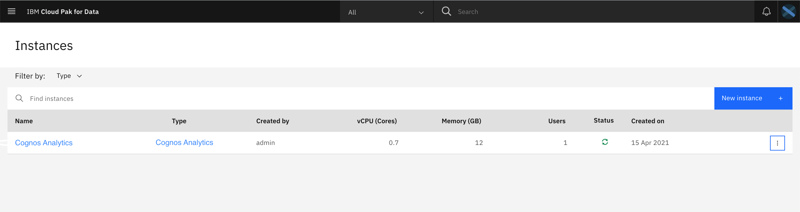

See the Cognos Analytics home page as below.
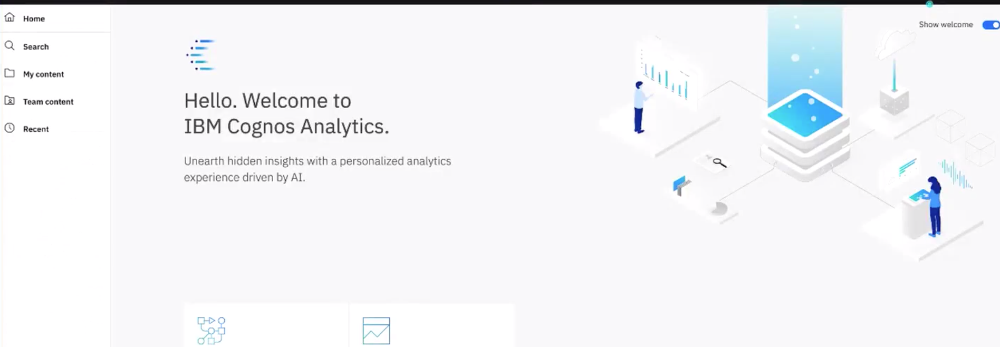

- Now to create a SingleStore database connection, click on `Manage`. See below screenshot for details.
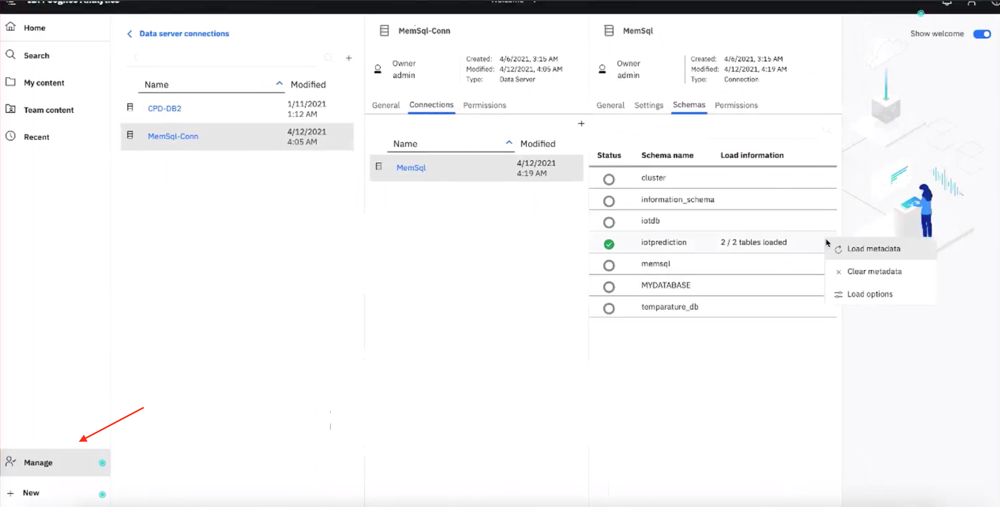

- Ensure you select either `Maria db connection or MySql` as database connection type and provide the SignleStore credentails. See the below screenshot for details.
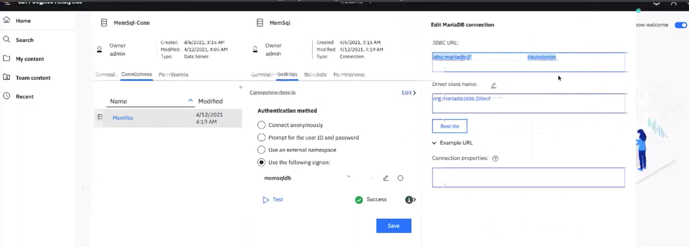

- In this code pattern, we have used MariaDB connections. See the below screenshot for details.
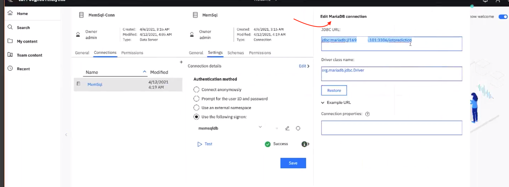

- Next, ensure to load the metadata of the tables that you want to consume from the Cognos Dashboard. In this code pattern to build the dashboard. we will use 2 tables(Data & Predictions). Data table is used to show historical data and the Predictions table will show data related predictions of the temperature of the containers from the AI model that we built and loaded in the SingleStore databse instance in the  previous step.
See below screenshot to load metadata of the tables.
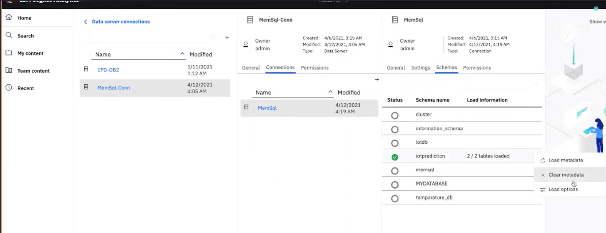

- See below screenshot for the sample data snapshot(SingleStore database) of the 2 tables that we have used in the Cognos Dashboard.

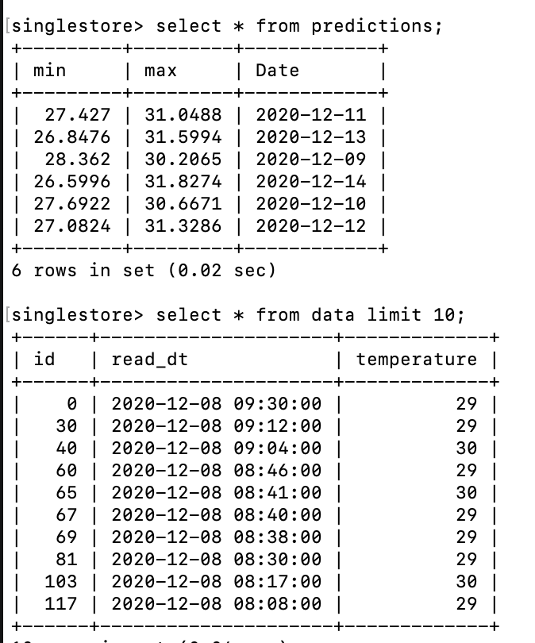


### ii. Create a module to load and publish the metadata to the cognos public folder section.

- Launch Data module to create a metadata package, which is used as in input source to build a Cognos Dashboard.


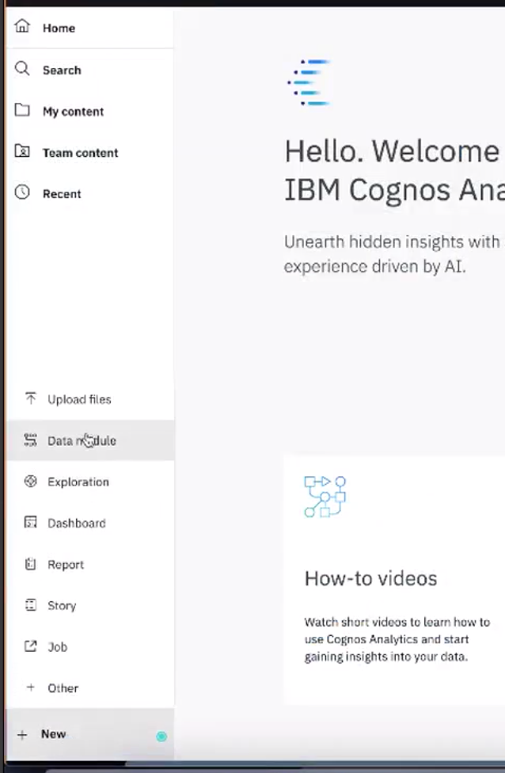

- Connect to SingleStore `iotpredictions` database. See below screenshot for details.

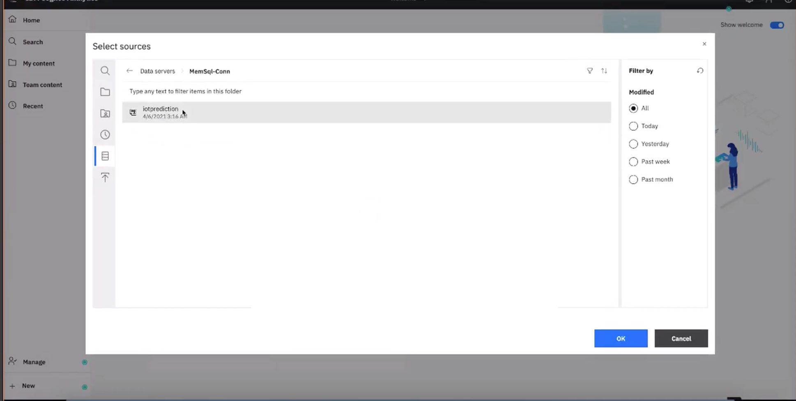

- Select the tables required for the dashboard and drag to the datamodule project pane. See below screenshot for details.

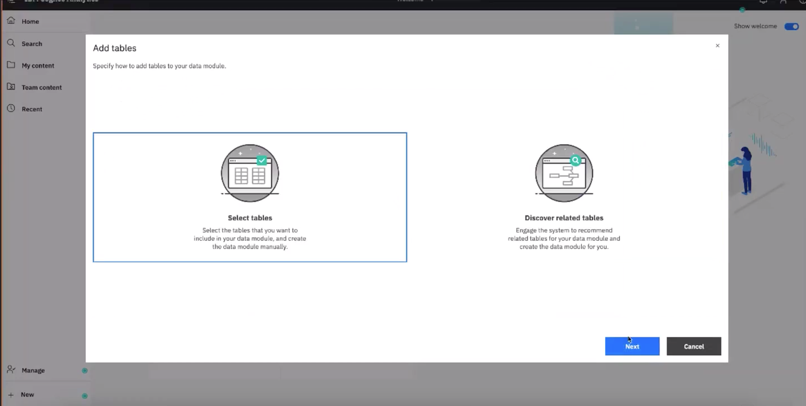
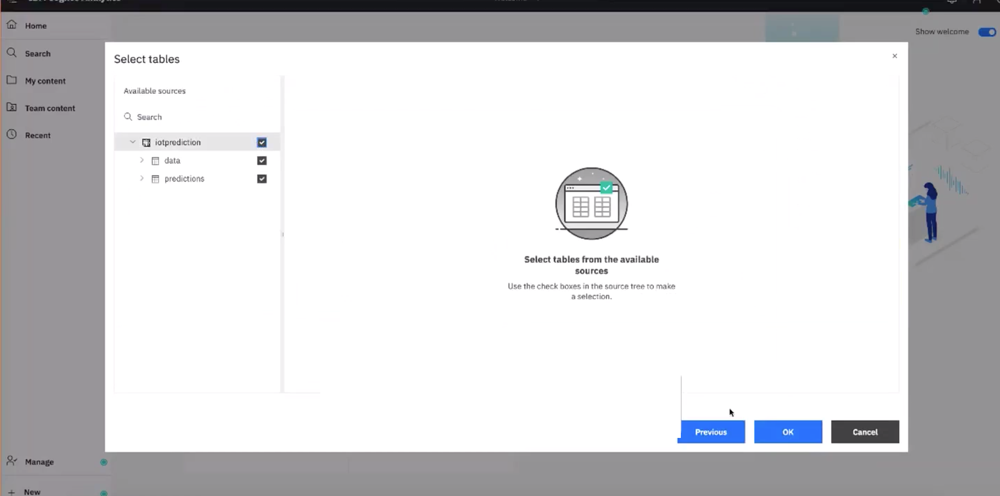

- Save the module within the Team Content folder of the Congos.
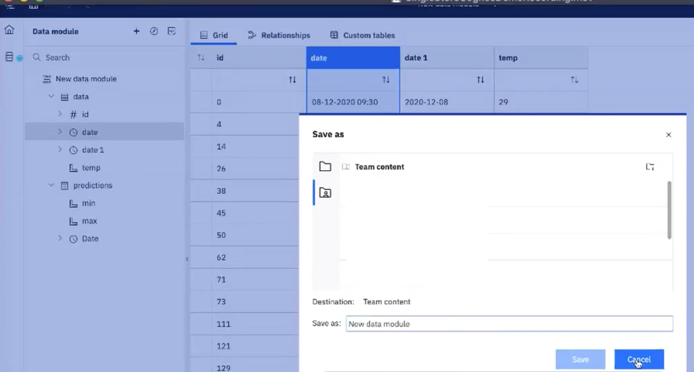


### iii. To access the module and build dashboard:


- Below is the dashboard which will represent the Historical and Average Temperature trends.
- Historical Temperature trends. We have used Date, and min & max temperature fields in x & Y axis respectively to build the below widget.
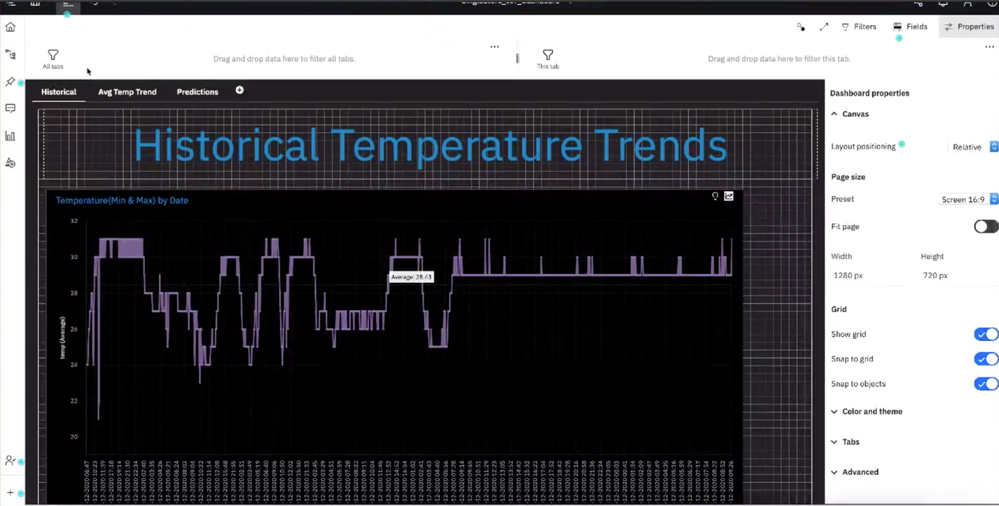

- Average Temperature trends by date. We have used Date, and min & max temperature fields in x & Y axis respectively to build the below widget.
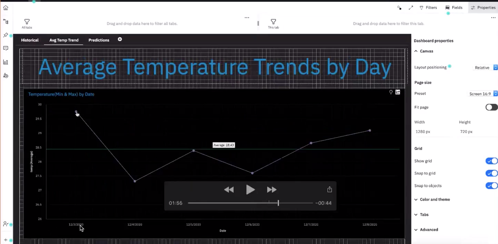

- Temperature Predictions for the next 7 days. We have used Date, and min & max Predicted temperature fields in x & Y axis respectively to build the below widget.
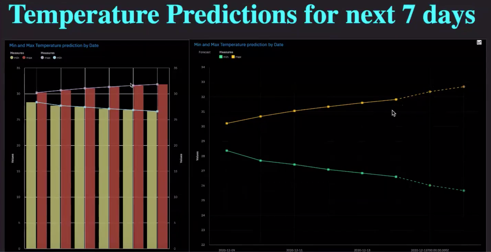

- To create a dashboard using IBM Cognos Analytics, refer to the [this tutorial.](https://developer.ibm.com/tutorials/build-dashboards-in-cognos-analytics-on-ibm-cloud-pak-for-data/)


## Summary

We have demonstrated live streaming coming through event streams, it is a secure connection from SingleStore through pipeline which is the most efficient way to ingest into SingleStore database, so if it was a high volume we can still do that. We have also built AI model in Cloud Pak for Data environment using SingleStore as a persistent storage for building and deploy and then executing the model realtime and we also have visualisation of not only historical data but also predictions data showcasing in Cognos dashboards which is again on IBM Cloud Pak for Data.
